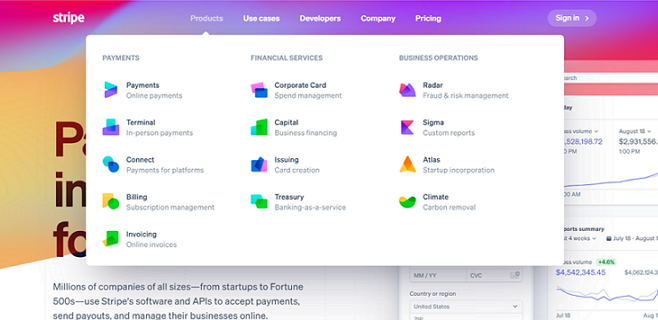
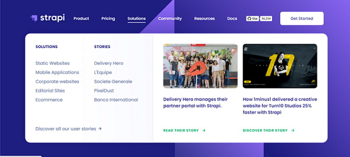

## Illustration

### --- Large Screens ---

[view page](https://femi-ologunwa.github.io/13-react-megamenu/)

### --- Mobile screens ---

[view page](https://femi-ologunwa.github.io/13-react-megamenu/)

### --- Inspiration ---

[view page](https://stripe.com/)

[view page](https://strapi.io/)

### --- Implementation ---

-  Show use of react icons library
-  implement onclick/onhover toggle fuctionality
-  using ternary operator to setup class name(s) on components
-  implement react context for data exchange
-  Rendering of items with nested iteration in sidebar component
-  Implement how to dynamically change the position (move around) of a component on the screen by using `useEffect`, `useRef` and `getBoundingClientRect()`;
